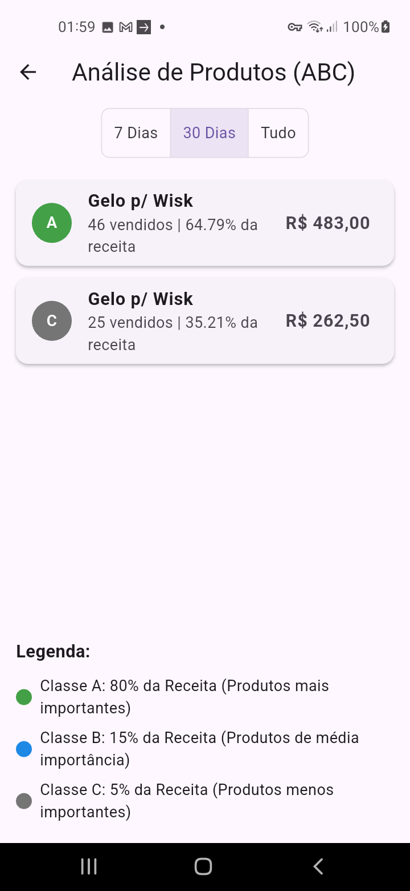

# StoreConnect - Sistema de Gestão para Lojas e Distribuidoras

[Read in English](#english-version)


**StoreConnect** é um sistema de Ponto de Venda (PDV) e gestão completo, desenvolvido em Flutter, projetado para otimizar as operações de pequenas e médias lojas e distribuidoras. A aplicação é focada em uma arquitetura multi-loja, permitindo que um único sistema gerencie múltiplos estabelecimentos de forma segura e centralizada, com dados armazenados e sincronizados em tempo real através do Firebase.

## ✨ Funcionalidades Principais

O aplicativo foi construído com uma base sólida, focando em funcionalidades essenciais para a gestão de um negócio:

### Gestão de Vendas
- **Tela de Venda Rápida (PDV):** Interface com grade de produtos responsiva que se adapta a diferentes tamanhos de tela (celulares, tablets).
- **Controle de Estoque em Tempo Real:** A interface visualiza o status do estoque de cada produto (normal, baixo, esgotado) e impede a venda de itens sem estoque.
- **Carrinho de Compras:** Sistema completo para adicionar produtos, com a flexibilidade de vender para um cliente cadastrado ou para o "Consumidor Final".
- **Múltiplos Métodos de Pagamento:** Suporte para vendas em Dinheiro, Cartão, PIX e "Fiado" (a prazo).
- **Vendas "Fiado":** Sistema para registrar vendas a prazo, exigindo a seleção de um cliente cadastrado.

### Gestão de Estoque
- **Cadastro e Edição de Produtos:** Formulário completo para gerenciar produtos, incluindo nome, preço, quantidade em estoque e **estoque mínimo** para alertas.
- **Upload de Imagens:** Suporte para upload de imagens de produtos tanto do celular quanto da web.
- **Baixa Automática de Estoque:** Após cada venda confirmada, a quantidade do produto é subtraída do estoque de forma atômica e segura, usando Batched Writes do Firebase.

### Gestão de Clientes (CRM)
- **Cadastro e Edição de Clientes:** Tela dedicada para gerenciar a base de clientes da loja.
- **Busca Inteligente:** Interface de busca dinâmica para encontrar clientes rapidamente.
- **Reutilização de Componentes:** A tela de gerenciamento também funciona como um seletor de clientes para outras partes do app (ex: vendas fiado).

### Dashboard e Relatórios
- **Dashboard em Tempo Real:** Painel principal com os KPIs (Indicadores Chave de Performance) mais importantes:
    - Total de Vendas do Dia
    - Número de Vendas
    - Ticket Médio
    - Total a Receber (Fiado)
    - Contagem de Produtos com Estoque Baixo
- **Hub de Relatórios:** Uma central organizada para análises mais profundas.
    - **Relatório de Vendas por Período:** Permite filtrar vendas por um intervalo de datas customizável.
    - **Relatório de Estoque Baixo:** Lista todos os produtos que precisam de reposição.
    - **Relatório de Contas a Receber:** Mostra a dívida total por cliente e permite detalhar e quitar as vendas pendentes.
    - **Análise de Curva ABC de Produtos:** Classifica os produtos em A, B e C, mostrando quais são os mais importantes para o faturamento da loja.

### Configurações e Segurança
- **Tela de Configurações:**
    - Permite habilitar/desabilitar a funcionalidade de vendas "Fiado".
    - Permite configurar o limite numérico para o alerta de estoque baixo.
- **Tela de Perfil do Usuário:**
    - Permite que o usuário edite seus dados de perfil (nome, documento, telefone).
    - Funcionalidade segura para **alterar senha e e-mail** diretamente no app, com reautenticação para garantir a segurança.
- **Autenticação Segura:** Fluxo completo de login e logout gerenciado pelo Firebase Auth e um `AuthGate` para proteger as rotas.

## 📸 Telas do Aplicativo

*(Instrução: Para adicionar suas imagens aqui, faça o upload delas para a pasta do seu projeto no GitHub e substitua as `URL_DA_SUA_IMAGEM_AQUI` pelo link da imagem)*

| Tela de Venda | Dashboard | Perfil e Segurança |
| :---: | :---: | :---: |
|  |  |  |

| Análise ABC | Contas a Receber | Gerenciar Produtos |
| :---: | :---: | :---: |
|  |  |  |


## 🚀 Tecnologias Utilizadas

- **Framework:** [Flutter](https://flutter.dev/)
- **Linguagem:** [Dart](https://dart.dev/)
- **Backend & Database:** [Firebase](https://firebase.google.com/)
    - **Cloud Firestore:** Banco de dados NoSQL em tempo real.
    - **Firebase Authentication:** Sistema de autenticação de usuários.
    - **Firebase Storage:** Armazenamento de imagens de produtos.
- **Gerenciamento de Estado:** [Provider](https://pub.dev/packages/provider)
- **Pacotes Principais:**
    - `cloud_firestore`
    - `firebase_auth`
    - `firebase_storage`
    - `image_picker`
    - `shared_preferences`
    - `intl`
    - `url_launcher`

## 🔮 Próximos Passos (Roadmap)

A próxima grande funcionalidade a ser implementada é a monetização do serviço, transformando o StoreConnect em um SaaS (Software as a Service).

- **☑️ Integração com Mercado Pago para Cobrança de Assinaturas**
    - [ ] Desenvolvimento de um sistema de planos (ex: Básico, Pro) com diferentes limites ou funcionalidades.
    - [ ] Integração com a API do Mercado Pago para gerar links de pagamento ou cobranças recorrentes (assinaturas) para cada loja cadastrada.
    - [ ] Desenvolvimento de **Cloud Functions** (lógica de backend no Firebase) para receber webhooks do Mercado Pago, validar os pagamentos e atualizar o status da assinatura da loja no Firestore (ex: `subscriptionStatus: 'active'` ou `'expired'`).
    - [ ] Lógica no `AuthGate` para bloquear o acesso às funcionalidades do app para lojas com assinatura pendente ou expirada.

## 🏁 Como Executar o Projeto

1.  **Pré-requisitos:**
    - Ter o [Flutter SDK](https://flutter.dev/docs/get-started/install) instalado.
    - Ter um editor de código como VS Code ou Android Studio.

2.  **Configuração do Firebase:**
    - Crie um novo projeto no [Console do Firebase](https://console.firebase.google.com/).
    - Habilite os serviços de **Authentication** (com o provedor E-mail/Senha), **Cloud Firestore**, e **Firebase Storage**.
    - Configure seu aplicativo (Android/iOS/Web) no projeto Firebase e adicione os arquivos de configuração (`google-services.json` para Android, etc.) no seu projeto Flutter.
    - O arquivo `lib/firebase_options.dart` deve ser gerado automaticamente via FlutterFire CLI.

3.  **Execução:**
    ```bash
    # Clone o repositório
    git clone [https://github.com/SEU_USUARIO/store_connect.git](https://github.com/SEU_USUARIO/store_connect.git)
    
    # Entre na pasta do projeto
    cd store_connect
    
    # Instale as dependências
    flutter pub get
    
    # Execute o aplicativo
    flutter run
    ```
---

👨‍💻 Autor
RodrigoCostaDEV

GitHub: @RodrigoCosta1983

LinkedIn:  [linkedin RodrigoCostaDEV](https://www.linkedin.com/in/dev-rodrigo-costa/)

Website: rodrigocosta-dev.com

## <a name="english-version"></a> English Version

[Leia em Português](#storeconnect---sistema-de-gestão-para-lojas-e-distribuidoras)


**StoreConnect** is a comprehensive Point of Sale (POS) and management system, developed in Flutter, designed to optimize the operations of small and medium-sized stores and distributors. The application is focused on a multi-store architecture, allowing a single system to manage multiple establishments securely and centrally, with data stored and synced in real-time via Firebase.

## ✨ Key Features

The application was built on a solid foundation, focusing on essential features for business management:

### Sales Management
- **Quick Sale Screen (POS):** A responsive product grid interface that adapts to different screen sizes (phones, tablets).
- **Real-time Inventory Control:** The interface displays the stock status of each product (normal, low, out of stock) and prevents the sale of out-of-stock items.
- **Shopping Cart:** A complete system for adding products, with the flexibility to sell to a registered customer or to a "Final Consumer".
- **Multiple Payment Methods:** Support for sales via Cash, Card, PIX, and "Fiado" (on credit).
- **"Fiado" (Credit) Sales:** A system to record on-credit sales, requiring the selection of a registered customer.

### Inventory Management
- **Product Creation and Editing:** A complete form to manage products, including name, price, quantity in stock, and a **minimum stock level** for alerts.
- **Image Uploads:** Support for uploading product images from both mobile and web.
- **Automatic Stock Decrement:** After each confirmed sale, the product quantity is atomically and safely subtracted from the inventory using Firebase Batched Writes.

### Customer Management (CRM)
- **Customer Creation and Editing:** A dedicated screen to manage the store's customer base.
- **Smart Search:** A dynamic search interface to find customers quickly.
- **Component Reuse:** The management screen also functions as a customer selector for other parts of the app (e.g., credit sales).

### Dashboard & Reports
- **Real-time Dashboard:** A main dashboard with the most important KPIs (Key Performance Indicators):
    - Total Sales for the Day
    - Number of Sales
    - Average Ticket
    - Total Accounts Receivable (Fiado)
    - Low Stock Product Count
- **Reports Hub:** An organized center for deeper analysis.
    - **Sales by Period Report:** Allows filtering sales by a customizable date range.
    - **Low Stock Report:** Lists all products that need restocking.
    - **Accounts Receivable Report:** Shows the total debt per customer and allows for viewing and settling pending sales.
    - **ABC Product Analysis:** Classifies products into A, B, and C, showing which are most critical to the store's revenue.

### Settings & Security
- **Settings Screen:**
    - Allows enabling/disabling the "Fiado" (on-credit) sales feature.
    - Allows configuring the numerical threshold for the low stock alert.
- **User Profile Screen:**
    - Allows the user to edit their profile data (name, document, phone).
    - Secure functionality to **change password and email** directly within the app, with re-authentication to ensure security.
- **Secure Authentication:** A complete login and logout flow managed by Firebase Auth and an `AuthGate` to protect routes.

## 📸 App Screens

*(Instruction: To add your images here, upload them to your project's folder on GitHub and replace the `URL_FOR_YOUR_IMAGE_HERE` with the image link)*

| Sale Screen | Dashboard | Profile & Security |
| :---: | :---: | :---: |
|  |  |  |

| ABC Analysis | Accounts Receivable | Manage Products |
| :---: | :---: | :---: |
|  |  |  |


## 🚀 Tech Stack

- **Framework:** [Flutter](https://flutter.dev/)
- **Language:** [Dart](https://dart.dev/)
- **Backend & Database:** [Firebase](https://firebase.google.com/)
    - **Cloud Firestore:** Real-time NoSQL database.
    - **Firebase Authentication:** User authentication system.
    - **Firebase Storage:** Product image storage.
- **State Management:** [Provider](https://pub.dev/packages/provider)
- **Key Packages:**
    - `cloud_firestore`
    - `firebase_auth`
    - `firebase_storage`
    - `image_picker`
    - `shared_preferences`
    - `intl`
    - `url_launcher`

## 🔮 Next Steps (Roadmap)

The next major feature to be implemented is the monetization of the service, turning StoreConnect into a SaaS (Software as a Service).

- **☑️ Mercado Pago Integration for Subscription Billing**
    - [ ] Development of a plan system (e.g., Basic, Pro) with different limits or features.
    - [ ] Integration with the Mercado Pago API to generate payment links or recurring charges (subscriptions) for each registered store.
    - [ ] Development of **Cloud Functions** (Firebase backend logic) to receive webhooks from Mercado Pago, validate payments, and update the store's subscription status in Firestore (e.g., `subscriptionStatus: 'active'` or `'expired'`).
    - [ ] Logic in the `AuthGate` to block access to the app's features for stores with a pending or expired subscription.

## 🏁 Getting Started

1.  **Prerequisites:**
    - Have the [Flutter SDK](https://flutter.dev/docs/get-started/install) installed.
    - Have a code editor like VS Code or Android Studio.

2.  **Firebase Setup:**
    - Create a new project in the [Firebase Console](https://console.firebase.google.com/).
    - Enable the **Authentication** (with the Email/Password provider), **Cloud Firestore**, and **Firebase Storage** services.
    - Configure your application (Android/iOS/Web) in the Firebase project and add the configuration files (`google-services.json` for Android, etc.) to your Flutter project.
    - The `lib/firebase_options.dart` file should be generated automatically via the FlutterFire CLI.

3.  **Running the Application:**
    ```bash
    # Clone the repository
    git clone [https://github.com/YOUR_USERNAME/store_connect.git](https://github.com/YOUR_USERNAME/store_connect.git)
    
    # Enter the project folder
    cd store_connect
    
    # Install dependencies
    flutter pub get
    
    # Run the application
    flutter run
    ```

👨‍💻 Developer
RodrigoCostaDEV

GitHub: @RodrigoCosta1983

LinkedIn:  [linkedin RodrigoCostaDEV](https://www.linkedin.com/in/dev-rodrigo-costa/)

Website: rodrigocosta-dev.com